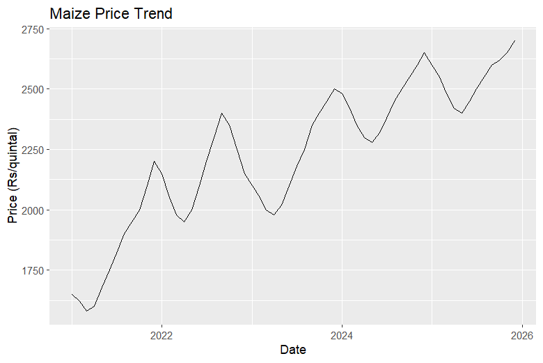

# Maize Price Forecast using ARIMA (R)

## Project Overview

This project analyzes historical maize mandi price data and forecasts future prices using time series modeling in R.

Agricultural commodity prices often fluctuate due to seasonality, supply conditions, weather patterns, and market demand. This project demonstrates how historical mandi price data can be used to identify trends and generate short-term price forecasts.

The analysis includes data visualization, time series conversion, ARIMA modeling, and forecasting.

---

## Dataset

Source: AGMARKNET (Agricultural Marketing Information Network)

The dataset contains monthly maize price data with the following fields:

| Column | Description                          |
| ------ | ------------------------------------ |
| date   | Date of observation                  |
| price  | Modal price of maize (₹ per quintal) |

Time period used: 5 years of historical data.

---

## Tools & Technologies

* **R**
* **RStudio**
* **ggplot2** – data visualization
* **forecast package** – time series forecasting

---

## Methodology

### 1. Data Loading

The maize price dataset is imported into R and checked for structure and formatting.

### 2. Data Cleaning

The date column is converted into proper Date format for time series analysis.

### 3. Data Visualization

Price trends are visualized using line plots to identify overall movement and seasonal patterns.

### 4. Time Series Conversion

The price data is converted into a time series object with monthly frequency.

### 5. ARIMA Model

The ARIMA model is used to identify patterns in historical price movements.

### 6. Price Forecasting

The fitted model is used to forecast maize prices for the next 12 months.

---

## Project Structure

```
maize-price-forecast
│
├── maize_price.csv
├── maize_price_analysis.R
├── maize_price_trend.png
├── price_forecast.png
└── README.md
```

---

## Price Trend



This plot shows the historical movement of maize prices over time.

---

## Forecast Output


The forecast plot shows predicted maize prices for the next 12 months based on historical trends.

---

## Key Insights

* Maize prices show gradual upward movement over time.
* Seasonal fluctuations are visible in the price trend.
* The ARIMA model can capture these patterns and generate short-term forecasts.

---

## How to Run the Project

1. Clone the repository
2. Open the R script in RStudio
3. Install required packages

```r
install.packages("ggplot2")
install.packages("forecast")
```

4. Run the analysis script

```
maize_price_analysis.R
```

---

## Future Improvements

* Incorporate mandi arrival data
* Include rainfall data for better forecasting
* Compare prices across multiple markets
* Apply advanced forecasting models such as SARIMA or Prophet

---

## Author

Kiran Jala
MBA Agribusiness Management
Interest: Agricultural Market Analysis & Data Analytics
