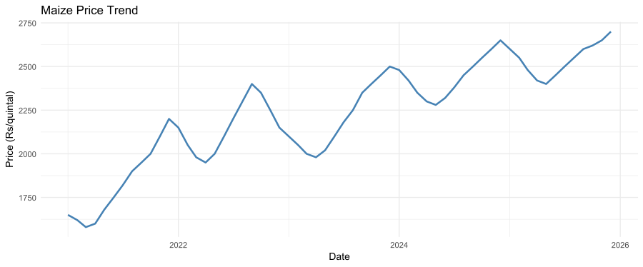
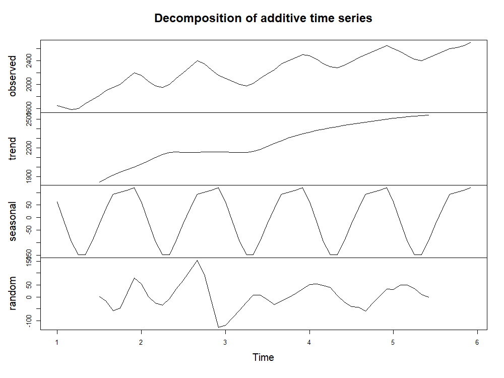
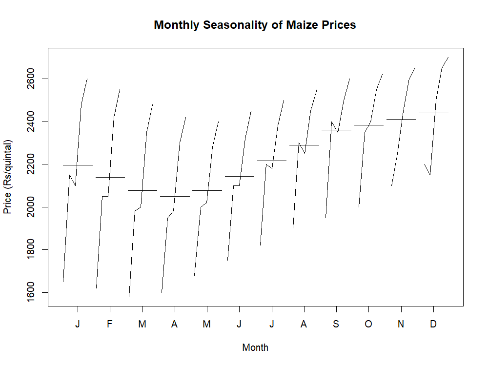
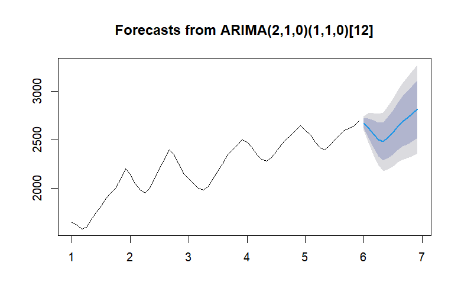

# Maize Price Analysis and Forecasting using R

## Project Overview

This project analyzes historical maize market price data using time series analysis in **R**. The objective is to understand price trends, identify seasonal patterns, and forecast future maize prices using statistical models.

Agricultural commodity prices are influenced by factors such as seasonal harvest cycles, supply conditions, market demand, and external shocks. This project demonstrates how **time series analysis and ARIMA forecasting** can help analyze agricultural price behavior.

---

## Dataset

The dataset contains historical maize price observations.

**Variables included:**

| Column | Description                        |
| ------ | ---------------------------------- |
| date   | Date of observation                |
| price  | Maize market price (₹ per quintal) |

The dataset contains **monthly observations for approximately five years**, which allows identification of long-term trends and seasonal price behavior.

---

## Tools Used

* **R**
* **RStudio**
* **ggplot2** – data visualization
* **forecast package** – time series forecasting

---

## Project Structure

```
maize-price-forecast
│
├── maize_price.csv
├── maize_price_analysis.R
├── maize_price_trend.svg
├── seasonal_decomposition.png
├── monthly_seasonality.png
├── price_forecast.png
└── README.md
```

---

## 1. Price Trend



The historical maize price trend shows a **steady upward movement over time**, with noticeable fluctuations. These fluctuations may be associated with seasonal supply variations, market arrivals, and changes in demand.

---

## 2. Seasonal Decomposition



Time series decomposition separates the data into four components:

* **Observed:** Original maize price series
* **Trend:** Long-term price movement
* **Seasonal:** Repeating patterns across months
* **Random:** Irregular fluctuations caused by external factors

The decomposition confirms that maize prices exhibit **both trend and seasonal patterns**.

---

## 3. Monthly Seasonality



The monthly seasonality plot highlights recurring price patterns across months.

Agricultural commodities often display seasonal price behavior due to harvest cycles and supply variations. Understanding these seasonal patterns helps farmers, traders, and agri-business firms anticipate price movements.

---

## 4. Price Forecast



An **ARIMA time series model** was used to forecast maize prices for the next 12 months.

The forecast suggests that maize prices are expected to **remain relatively stable with a gradual upward trend**, although uncertainty increases further into the forecast horizon.

---

## Methodology

The analysis followed these steps:

1. Load and preprocess maize price data
2. Visualize historical price trends
3. Convert price data into a time series object
4. Decompose the time series to identify trend and seasonal components
5. Fit an ARIMA model to the data
6. Generate forecasts for the next 12 months

---

## Key Insights

* Maize prices show a **long-term upward trend**
* A **seasonal pattern** is present in the data
* Time series decomposition reveals structured price behavior
* ARIMA forecasting suggests **moderate price growth in the future**

---

## How to Run the Project

1. Clone this repository
2. Open the project in **RStudio**
3. Install required packages:

```r
install.packages("ggplot2")
install.packages("forecast")
```

4. Run the analysis script:

```
maize_price_analysis.R
```

The script will generate all plots used in this analysis.

---

## Author

**Kiran Jala**

MBA Agribusiness Management
Interest: Agricultural market analysis and data analytics
