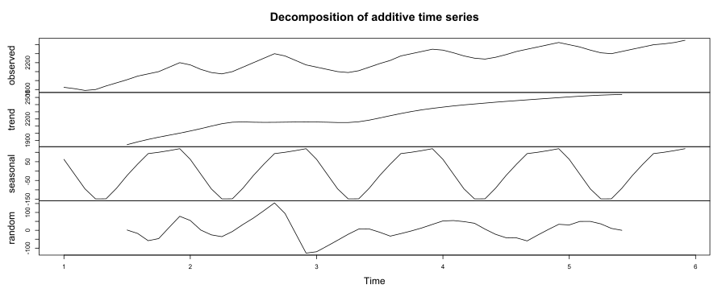
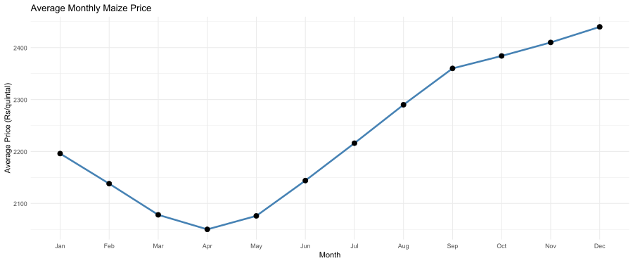
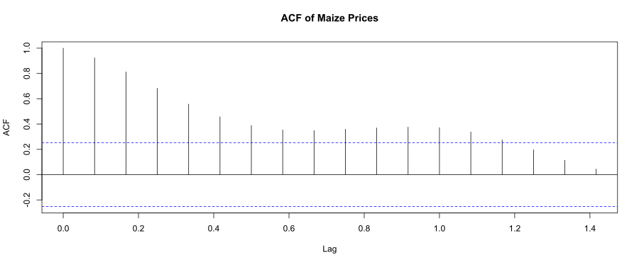
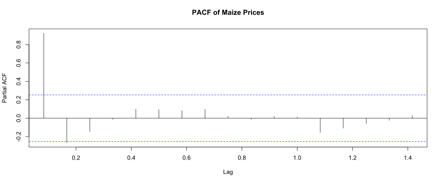
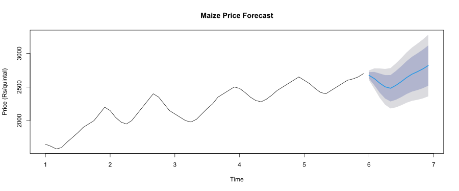

# Maize Price Analysis and Forecasting using R

## Project Overview

This project analyzes historical maize market price data using **time series analysis in R**.
The objective is to understand **price trends, seasonal patterns, and forecast future maize prices**.

Agricultural commodity prices are influenced by seasonal harvest cycles, supply conditions, market demand, and external factors. This project demonstrates how **time series analysis and ARIMA forecasting** can be applied to agricultural market data.

---

## Dataset

The dataset contains historical maize price observations.

| Column | Description                        |
| ------ | ---------------------------------- |
| date   | Date of observation                |
| price  | Maize market price (₹ per quintal) |

The dataset contains **monthly observations for approximately five years**, allowing identification of long-term trends and seasonal price behavior.

---

## Tools Used

* **R**
* **RStudio**
* **ggplot2** – data visualization
* **forecast package** – time series forecasting

---

## Project Structure

```
maize-price-forecast
│
├── maize_price.csv
├── maize_price_analysis.R
├── maize_price_trend.svg
├── seasonal_decomposition.svg
├── average_monthly_maize_prices.svg
├── acf_plot.svg
├── pacf_plot.svg
├── price_forecast.svg
└── README.md
```

---

## 1. Price Trend


The historical maize price trend shows a **steady upward movement over time**, with noticeable fluctuations. These fluctuations may be associated with seasonal supply variations and market demand changes.

---

## 2. Seasonal Decomposition



Time series decomposition separates the data into:

* **Trend** – long-term price movement
* **Seasonal** – repeating patterns across months
* **Random** – irregular fluctuations

The decomposition confirms that maize prices exhibit **both trend and seasonal behavior**.

---

## 3. Average Monthly Prices



This chart shows the **average maize price for each month**.

It indicates a **seasonal price pattern**, where prices tend to be relatively lower in the early months of the year and increase toward the later months.

---

## 4. Autocorrelation Analysis

### ACF Plot



The Autocorrelation Function (ACF) plot shows the relationship between current maize prices and their past values. Significant correlations at early lags indicate that past prices influence current price movements.

---

### PACF Plot



The Partial Autocorrelation Function (PACF) plot helps identify the autoregressive components in the time series and supports the selection of an appropriate ARIMA model.

---

## 5. Price Forecast



An **ARIMA time series model** was used to forecast maize prices for the next 12 months.

The forecast suggests that maize prices are expected to **remain relatively stable with a gradual upward trend**, although uncertainty increases further into the forecast horizon.

---

## Methodology

The analysis followed these steps:

1. Load and preprocess maize price data
2. Visualize historical price trends
3. Convert price data into a time series object
4. Decompose the time series to identify trend and seasonal components
5. Analyze autocorrelation using ACF and PACF plots
6. Fit an ARIMA model
7. Generate price forecasts for the next 12 months

---

## Key Insights

* Maize prices show a **long-term upward trend**
* A **seasonal pattern** exists in the data
* Autocorrelation analysis indicates dependence on past prices
* ARIMA forecasting suggests **moderate price growth in the coming months**

---

## How to Run the Project

1. Clone this repository

2. Open the project in **RStudio**

3. Install required packages

```r
install.packages("ggplot2")
install.packages("forecast")
```

4. Run the analysis script

```
maize_price_analysis.R
```

The script will generate all plots used in this analysis.

---

## Author

**Kiran Jala**
MBA Agribusiness Management

Interest areas: **Agricultural market analysis, commodity price forecasting, and data analytics.**
